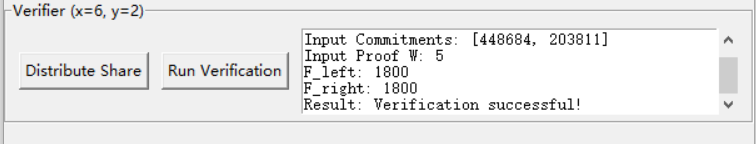

# polynomial_commitment_secrete_sharing

> 中文：基于多项式承诺的可验证秘密分享毕业设计项目  
> English: A graduation project on verifiable secret sharing based on polynomial commitments

## 中文说明

### 项目简介

本项目对应 `2025` 年海南大学本科毕业设计《基于多项式承诺的可验证秘密分享》。

项目的核心目标是把下面三部分结合起来：

- 多项式承诺（Polynomial Commitment）
- FRI 风格的降幂处理
- 秘密分享与恢复

仓库中的实现以论文 *Efficient polynomial commitment schemes for multiple points and polynomials* 为基础思路，并结合 UTF-8 消息编码、秘密分片和批量验证流程，构造了一个带图形界面的教学型原型系统。

### 这个项目解决了什么问题

普通秘密分享只能解决“把秘密拆开再恢复”，但不能天然保证“分发出来的份额是不是和承诺一致”。这个项目在秘密分享之外，又加入了承诺与验证机制，使参与者除了拿到份额以外，还能额外检查：

- 证明者是否真的按同一组多项式在分发
- 承诺值、见证值和插值结果是否彼此一致
- 恢复出的秘密是否能重新解码成原始消息

### 核心思路

整个流程可以按下面 6 步理解：

1. 将输入消息按 `UTF-8` 编码成一个大整数。
2. 将这个整数拆成多个常数片段，分别嵌入多项式的常数项中。
3. 对高次多项式执行 FRI 风格的降幂处理，把次数压到较小范围内。
4. 在每个多项式对应的点集 `S_i` 上求值，并插值得到辅助多项式 `r_i(x)`。
5. 证明者在用户选定的 `x` 处生成承诺值 `cm_i`，再结合挑战值 `y` 生成见证 `W`。
6. 验证者检查左右两边是否相等，从而判断承诺与证明是否成立；之后也可以基于门限份额做秘密恢复。

### 代码里实际对应的验证关系

从 `main_withui_finally.py` 的实现来看，验证阶段实际比较的是：

- 左边：`F_left = W * Z_T(x)`
- 右边：`F_right = Σ_i (cm_i - r_i(x)) * y^i * Z_i(x)`

如果两边相等，就判定验证成功。

这也是 README 里最值得强调的一点：本项目不是只做“分片”，而是做“带承诺与验证的分片”。

### 创新点

1. 对待分享多项式加入 FRI 风格的降幂处理，使多项式次数保持在较可控的范围内，进而控制承诺和证明的复杂度。
2. 不把整条消息直接塞进单个多项式，而是先编码、再拆分到多个多项式的常数项里，增强秘密分享过程中的灵活性。
3. 保留了多点评估、多多项式批量验证的思路，使承诺与验证过程更适合做“可验证”的秘密分享演示。
4. 提供了两个独立的 Tkinter 图形界面，分别负责“承诺/验证”和“秘密恢复”，更适合课程展示。

### 仓库结构

| 文件 | 说明 |
| --- | --- |
| `main_withui_finally.py` | 主界面程序：初始化证明者、分发承诺值、生成见证、执行验证 |
| `secret_clipswithui.py` | 秘密恢复界面：输入门限份额、拉格朗日插值、恢复常数并解码消息 |
| `FRI.py` | FRI 风格降幂逻辑，将高次项拆分并折叠 |
| `message_coding.py` | 消息编码、整数拆分、整数合并与解码 |
| `polynomial_division.py` | 有限域下的多项式除法 |
| `rxi.py` | 根据点集做有限域插值，求出辅助多项式系数 |
| `commitment ui.png` | 承诺界面截图 |
| `verification.png` | 验证结果截图 |
| `recovery ui.png` | 恢复界面截图 |

### 运行环境

推荐使用 `Python 3.9+`，依赖如下：

```bash
pip install numpy sympy
```

说明：

- `tkinter` 通常随标准 Python 一起安装。
- 如果你的 Python 环境没有图形界面支持，需要额外安装对应系统组件。

### 使用方式

#### 1. 运行承诺与验证界面

```bash
python main_withui_finally.py
```

界面中主要包含两部分操作：

- 初始化证明者
- 添加验证者并执行验证

初始化证明者时，需要填写：

- `多项式数量`
- `有限域`
- `点集 T`
- 每个多项式对应的 `S` 和系数
- 需要编码的消息

需要注意：

- 每行输入格式是 `S;coefficients`
- `S` 中必须包含 `0`
- 当前代码限制 `len(S) <= 6`
- 系数输入为“从高到低”，且**不包含常数项**
- 常数项会在程序内部被替换成拆分后的秘密片段

#### 2. 运行秘密恢复界面

```bash
python secret_clipswithui.py
```

这个界面用于：

- 输入多项式数量、有限域、门限 `k`
- 填写每份 share 的 `x` 和每个多项式对应的 `y`
- 使用拉格朗日插值恢复常数项
- 合并整数并解码回原始消息

### 界面截图

保留仓库中的原始图片如下。

#### 承诺界面


#### 验证结果



#### 恢复界面


### 适合阅读代码时先看的文件

如果你准备从代码角度理解整个项目，建议按下面顺序阅读：

1. `main_withui_finally.py`
2. `message_coding.py`
3. `FRI.py`
4. `rxi.py`
5. `secret_clipswithui.py`

这样会比较容易先理解“消息如何进入多项式”，再理解“承诺如何验证”，最后理解“秘密如何恢复”。

### 注意事项

- 当前实现更适合课程设计、论文复现和原型演示，不是面向生产环境的完整密码系统。
- 有限域运算默认建立在模数可逆的前提上，实际使用时更适合选素数域。
- `FRI.py` 中的降幂策略是项目里的工程化改写，用于控制次数，不等同于完整工业级 FRI 协议实现。
- 界面交互和参数检查以演示为主，复杂输入场景下仍建议结合代码阅读使用。

### 参考文献

- Boneh et al., *Efficient polynomial commitment schemes for multiple points and polynomials*  
  [https://eprint.iacr.org/2020/081](https://eprint.iacr.org/2020/081)

### 致谢

这个项目完成于本科毕业设计阶段。原 README 里那种“要出发去下一段人生”的感觉我保留下来了，只是把主体说明整理得更适合公开仓库阅读。

出发吧，不管去到哪里，继续温柔、缓慢而坚定地前进。

## English Overview

### Summary

This repository is a graduation-project prototype for **verifiable secret sharing based on polynomial commitments**.

It combines:

- polynomial commitments,
- FRI-style degree reduction,
- message sharding,
- and threshold-based secret recovery.

The implementation is inspired by *Efficient polynomial commitment schemes for multiple points and polynomials*, while adapting the workflow to a GUI-based educational prototype.

### Main Workflow

1. Encode the input message into a large integer using UTF-8.
2. Split that integer into several constant fragments.
3. Embed the fragments into the constant terms of multiple polynomials.
4. Reduce high polynomial degrees with an FRI-style folding step.
5. Generate commitments and a witness for selected verifier inputs.
6. Recover the secret later with threshold shares and decode the original message.

### Verification Equation Used in Code

The implementation in `main_withui_finally.py` verifies:

- `F_left = W * Z_T(x)`
- `F_right = Σ_i (cm_i - r_i(x)) * y^i * Z_i(x)`

Verification succeeds when both sides are equal.

### Repository Structure

| File | Purpose |
| --- | --- |
| `main_withui_finally.py` | GUI for prover initialization, commitment generation, witness generation, and verification |
| `secret_clipswithui.py` | GUI for secret recovery and message decoding |
| `FRI.py` | FRI-style degree-reduction logic |
| `message_coding.py` | Message encoding, splitting, merging, and decoding |
| `polynomial_division.py` | Polynomial division over a finite field |
| `rxi.py` | Finite-field interpolation from point sets |

### Quick Start

Install dependencies:

```bash
pip install numpy sympy
```

Run the commitment / verification UI:

```bash
python main_withui_finally.py
```

Run the secret recovery UI:

```bash
python secret_clipswithui.py
```

### Notes

- This project is best understood as a teaching and prototype implementation.
- It is suitable for thesis demonstration, algorithm explanation, and code reading.
- The included screenshots are preserved from the original repository content.
